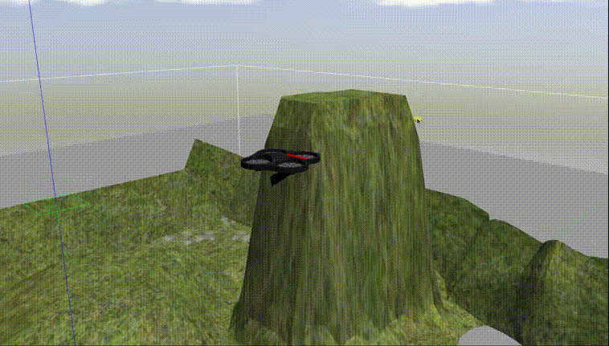
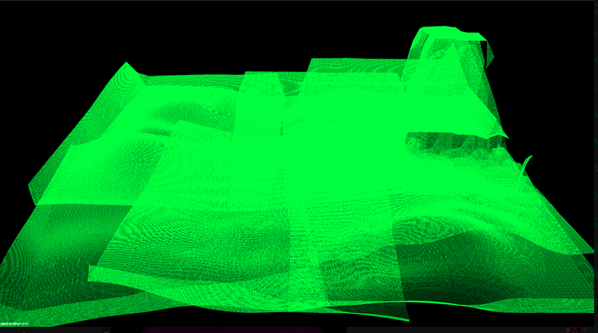
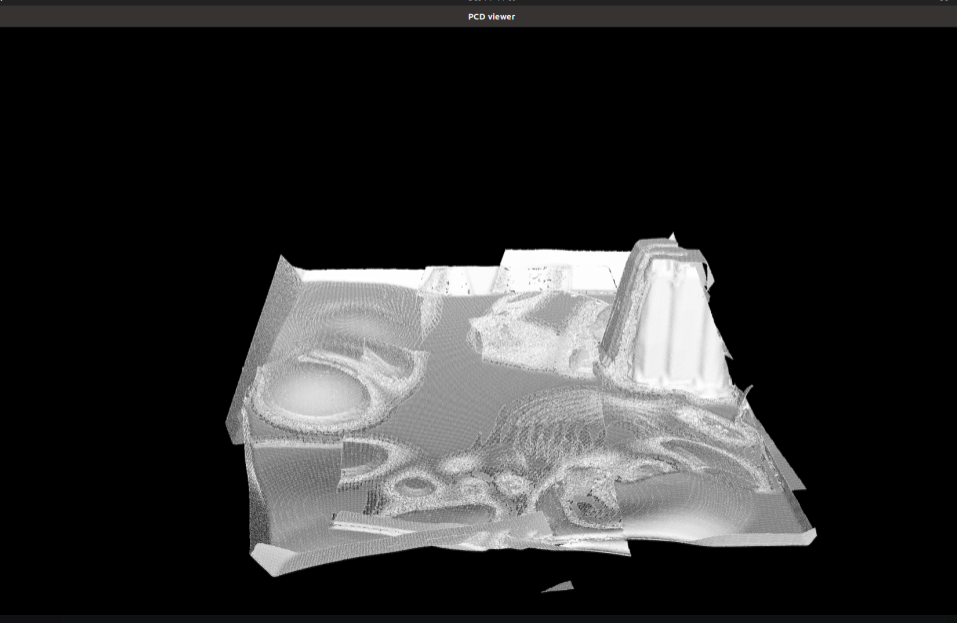
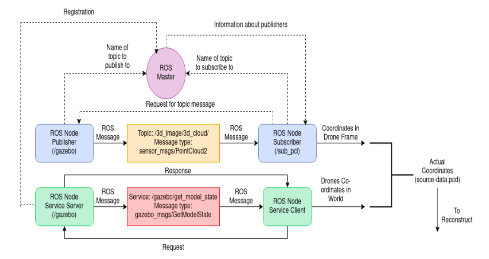

# 3D Reconstruction with Quadrotor and PCL

This project focuses on simulating a quadrotor flying over a terrain, equipped with a GPS and Depth Sensor, to collect 3D point cloud data. The collected data is then processed to create an accurate 3D representation of the terrain through surface reconstruction techniques, implemented using the **Point Cloud Library (PCL)**.




1. **Point Cloud Acquisition**  
   Data is captured by LiDAR sensors and the GPS, which provides the 3D coordinates of each data point in space.
   

2. **Surface Reconstruction**  
   The 3D model is reconstructed using algorithms like **Greedy Projection Triangulation** (GPT), which generates a mesh from the point cloud data.
   

---

## Contents

- [Project Overview](#project-overview)
  - [Technologies Used](#technologies-used)
  - [Directory Structure](#directory-structure)
  - [Mathematical Background](#mathematical-background)
- [Setup and Installation](#setup-and-installation)
  - [Dependencies](#dependencies)
  - [Installation Instructions](#installation-instructions)
  - [Running the Project](#running-the-project)
- [Workflow Diagram](#workflow-diagram)

---

## Project Overview

The goal of this project is to create a 3D model of the terrain using point cloud data captured by a quadrotor. The process includes several mathematical steps, such as surface reconstruction from point clouds, mesh generation, and the application of geometric algorithms to handle the data.

Key steps include:

- **Data Acquisition**: LiDAR sensors capture the terrain's 3D data, which is then processed to identify surface points.
- **Surface Reconstruction**: Algorithms like **Greedy Projection Triangulation** and **Poisson Surface Reconstruction** are used to generate meshes from point cloud data.
- **Mathematics in Reconstruction**: This involves techniques like **Moving Least Squares** for point cloud smoothing and **Maximum Likelihood Estimation** for generating optimal surfaces.

### Technologies Used

The project utilizes the following technologies:

- **ROS Noetic**: Manages sensor integration and controls for the drone.
- **Gazebo**: Simulation environment for visualizing the drone and terrain.
- **RViz**: Tool for visualizing point clouds and 3D models.
- **Point Cloud Library (PCL)**: Provides various algorithms for point cloud processing and surface reconstruction.
- **MeshLab**: Used for post-processing and refining the 3D meshes.

---

## Mathematical Background

This project relies heavily on several mathematical concepts, particularly in the area of 3D geometry, linear algebra, and statistical methods. Below are some of the key mathematical concepts and formulas used in the project.

## **1. Point Cloud Data Acquisition**

The drone collects 3D point cloud data using depth sensors or LiDAR. Each point in the cloud is represented as:

$$
P_i = (x_i, y_i, z_i)
$$

where $x_i, y_i, z_i$ are the coordinates of the $i$-th point in a 3D space. These points represent the surface geometry of the terrain.

---

## **2. Surface Normal Estimation**

To reconstruct a smooth surface from discrete points, surface normals are estimated for each point. The normal vector $\mathbf{n}_i$ at a point $P_i$ is computed using its nearest neighbors. The covariance matrix of the neighbors is calculated as:

$$
C = \frac{1}{k} \sum_{j=1}^{k} (\mathbf{p}_j - \bar{\mathbf{p}})(\mathbf{p}_j - \bar{\mathbf{p}})^T
$$

where:
- $\mathbf{p}_j$ are the neighboring points,
- $\bar{\mathbf{p}}$ is their centroid.

The eigenvector corresponding to the smallest eigenvalue of $C$ gives the surface normal.

---

## **3. Moving Least Squares (MLS) for Smoothing**

To reduce noise in the point cloud, MLS is applied. The MLS method fits a polynomial surface to local neighborhoods and projects points onto this surface. The fitted polynomial minimizes:

$$
E = \sum_{i=1}^{n} w(\|\mathbf{p}_i - \mathbf{q}\|^2) (\mathbf{f}(\mathbf{q}) - z_i)^2
$$

where:
- $w(\cdot)$ is a weighting function,
- $\mathbf{q}$ is the projection point,
- $\mathbf{f}(\cdot)$ is the polynomial function.

---

## **4. Greedy Projection Triangulation (GPT)**

GPT is used to create a triangular mesh from the point cloud. The algorithm iteratively adds triangles by connecting neighboring points based on their spatial proximity and angle constraints.

The quality of a triangle is determined by its circumradius-to-shortest-edge rat    io $R_{\text{circum}}/R_{\text{shortest}}$, ensuring well-shaped triangles.

---

## **5. Marching Cubes Algorithm**

For volumetric data, the Marching Cubes algorithm extracts an iso-surface by dividing the space into cubes and determining intersections with a scalar field $f(x, y, z)$. It identifies surface vertices by solving:

$$
f(x, y, z) = c
$$

where $c$ is an iso-value representing terrain height.

---

## **6. Depth Calculation in Stereo Vision**

For stereo vision systems, depth ($Z$) is calculated using disparity ($d$) between two images:

$$
Z = \frac{f \cdot B}{d}
$$

where:
- $f$ is the focal length,
- $B$ is the baseline distance between cameras,
- $d = x_{\text{left}} - x_{\text{right}}$.

This triangulation provides 3D coordinates from 2D image correspondences.

---

## **7. Digital Elevation Model (DEM)**

To create a DEM from raw data:
1. A grid-based interpolation method (e.g., bilinear or spline interpolation) fills gaps in point clouds.
2. Heights are represented as a continuous function:

$$
z = f(x, y)
$$


---

## Setup and Installation

### Dependencies

Make sure to have the following software installed:

- **Ubuntu 20.04**
- **ROS Noetic**: Installation guide [here](http://wiki.ros.org/noetic/Installation)
- **Gazebo**: Simulation tool for 3D visualization [instructions](http://gazebosim.org/)
- **Point Cloud Library (PCL)**: Point cloud processing library [download](https://pointclouds.org/downloads/#linux)

### Installation Instructions

1. Clone the repository:

    ```bash
    git clone https://github.com/iamkrunalrk/3D-reconstruction-with-quadrotor.git
    ```

2. Add the repository to your **catkin workspace**:

    ```bash
    mkdir -p ~/catkin_ws/src
    cd ~/catkin_ws/src
    git clone https://github.com/iamkrunalrk/3D-reconstruction-with-quadrotor.git
    ```

3. Build the workspace:

    ```bash
    cd ~/catkin_ws
    catkin build
    source ~/catkin_ws/devel/setup.bash
    ```

### Running the Project

To run the project, open three terminals and execute the following commands:

- **Terminal 1**: Launch the drone simulation:

    ```bash
    roslaunch sjtu_drone simple.launch
    ```

- **Terminal 2**: Control the drone’s movement:

    ```bash
    rosrun sjtu_drone drone_keyboard
    ```

- **Terminal 3**: Process point cloud data:

    ```bash
    rosrun sjtu_drone listener
    ```

---

## Workflow Diagram

Below is a detailed flow of the project from drone flight to 3D terrain mapping:



---
